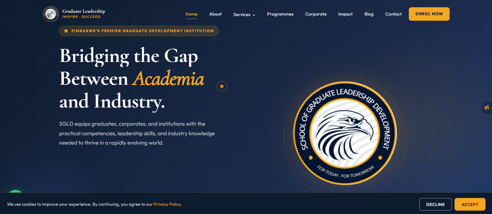
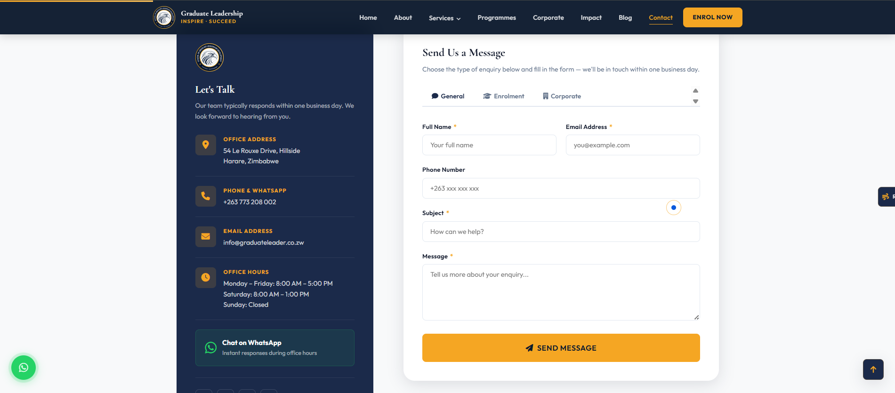
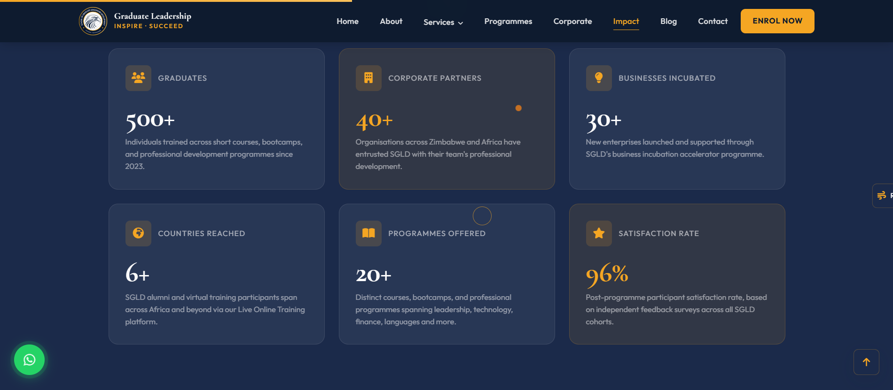
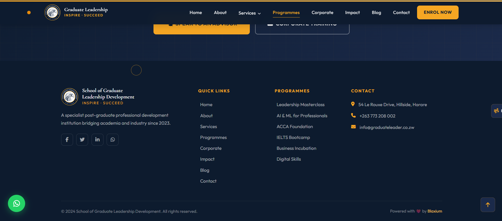

# School of Graduate Leadership Development

A specialist post-graduate professional development institution bridging the gap between academic institutions and the demands of industry. Built to transform Zimbabwe's graduate workforce through practical skills development, leadership training, and industry-relevant capacity building.

**Live Website:** [https://graduateleader.co.zw](https://graduateleader.co.zw)

---

## About SGLD

The School of Graduate Leadership Development (SGLD) was incorporated in Zimbabwe in 2023 to address one of the country's most pressing socio-economic challenges — graduate unemployment. Despite graduating thousands of young professionals annually, universities and colleges were producing graduates who lacked the practical, industry-relevant skills that employers actually needed.

SGLD bridges that gap. Operating under the philosophy of lifelong learning, we exist not as a degree-awarding institution, but as a dynamic skills-development and capacity-building powerhouse that equips graduates, corporates, and institutions with the competencies that drive real economic value and career advancement.

### Mission

To bridge the widening gap between academic institutions and industry by equipping graduates, corporates, and institutions with practical competencies, leadership skills, and industry-specific knowledge — nurturing innovation, supporting business incubation, and forging strategic partnerships locally and internationally.

### Vision

To become the most impactful post-graduate professional development institution in Africa — recognised for transforming graduates into industry leaders, catalysing entrepreneurship, and building the human capital that drives sustainable economic growth across the continent.

---

## Core Services

- **Research & Development** — Applied research and innovation support
- **Business Incubation** — Entrepreneurship acceleration and mentorship
- **Life Skills Coaching** — Personal effectiveness and career development
- **Capacity Building** — Organisational and institutional upskilling
- **Corporate Training** — Group training and executive programmes
- **Human Capital Consultancy** — Strategic HR advisory and talent development

---

## Technology Stack

- **Frontend:** HTML5, CSS3, JavaScript (ES6+)
- **Styling:** Custom CSS with CSS Grid and Flexbox
- **Animations:** AOS (Animate On Scroll), GSAP
- **Icons:** Font Awesome 6
- **Fonts:** Google Fonts (Roboto, Open Sans)
- **Backend:** PHP (contact form processing)
- **Deployment:** cPanel/CyberPanel (XAMPP for local development)

---

## Features

- Fully responsive design (mobile-first approach)
- Animated hero sections and scroll-driven entrance effects
- Multi-tab contact forms with spam protection (honeypot + keyword filtering)
- Interactive team profile cards
- Accordion-based FAQ sections
- Embedded Google Maps integration
- WhatsApp floating button for instant enquiries
- Cookie consent banner
- Motion reduction accessibility toggle
- SEO-optimised with meta tags and structured content

---

## Screenshots

### Homepage

### Contact Page

### Impact Page

### Footer

---

## Contact Information

**Address:** 54 Le Rouxe Drive, Hillside, Harare, Zimbabwe  
**Phone:** +263 773 208 002  
**Email:** info@graduateleader.co.zw  
**Office Hours:** Mon–Fri 8:00 AM – 5:00 PM, Sat 8:00 AM – 1:00 PM

---

## License

Copyright 2024 School of Graduate Leadership Development. All rights reserved.

---

**Developed by [bguvava](https://github.com/bguvava) | Powered with ❤️ by [Blaxium](https://blaxium.com)**

